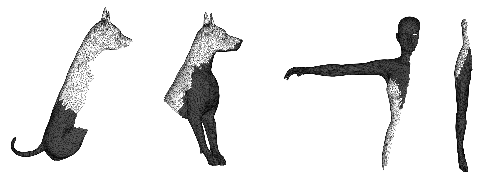
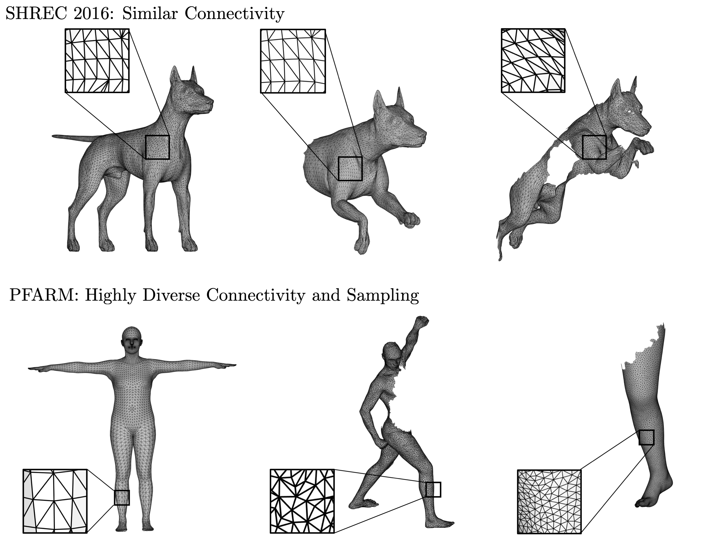

# CP2P & PFARM Partial Shape Matching Benchmarks
Benchmarks for non-rigid partial shape matching, from: "DPFM: Deep Partial Functional Maps" - 3DV 2021 (Oral)

[](https://arxiv.org/abs/2110.09994) [](https://github.com/pvnieo/DPFM)

## CP2P

The purpose of this datset is to provide a testbed for the task of **partial to partial non rigid shape matching**.

**CP2P** is based on the CUTS training set in the shrec 16 partial benchmark, and contains the same 8 classes of humans and animals in different poses and partialities and establishes a total of **300 pairs** for matching. The train and test sets are divided randomly with 80% pairs for training, and the remaining 20% for testing. The splits are provided in `cp2p/splits`.

The overlap between the source and target shapes varies from **10%** to **90%** of the total area.
## PFARM

The objective of **PFARM** is to test the robustness of partial shape matching methods to significantly varying mesh connectivity and sampling. **PFARM** is created using the SHREC’19 dataset, and it comprises of 25 test pairs resulting from 26 human shapes (one null shape). The shapes have **significantly different meshing, vertex density, undergo varied rigid and non-rigid deformations and have significant partiality**.

## SHREC16' Partial Matching Benchmark
Due to popular demand, we also provide in this repository the SHREC16' partial benchmark test set (both shapes and ground truth maps). Please note that we provide it only for convenience, and that all credits should go to the original authors. The train set can be downloaded from the [benchmark website](https://www.dais.unive.it/~shrec2016/).


## Citation
Please cite these benchmarks as:
```bibtex
@inproceedings{attaiki2021dpfm,
  doi = {10.1109/3dv53792.2021.00040},
  url = {https://doi.org/10.1109/3dv53792.2021.00040},
  year = {2021},
  month = dec,
  publisher = {{IEEE}},
  author = {Souhaib Attaiki and Gautam Pai and Maks Ovsjanikov},
  title = {{DPFM}: Deep Partial Functional Maps},
  booktitle = {2021 International Conference on 3D Vision (3DV)}
}
```